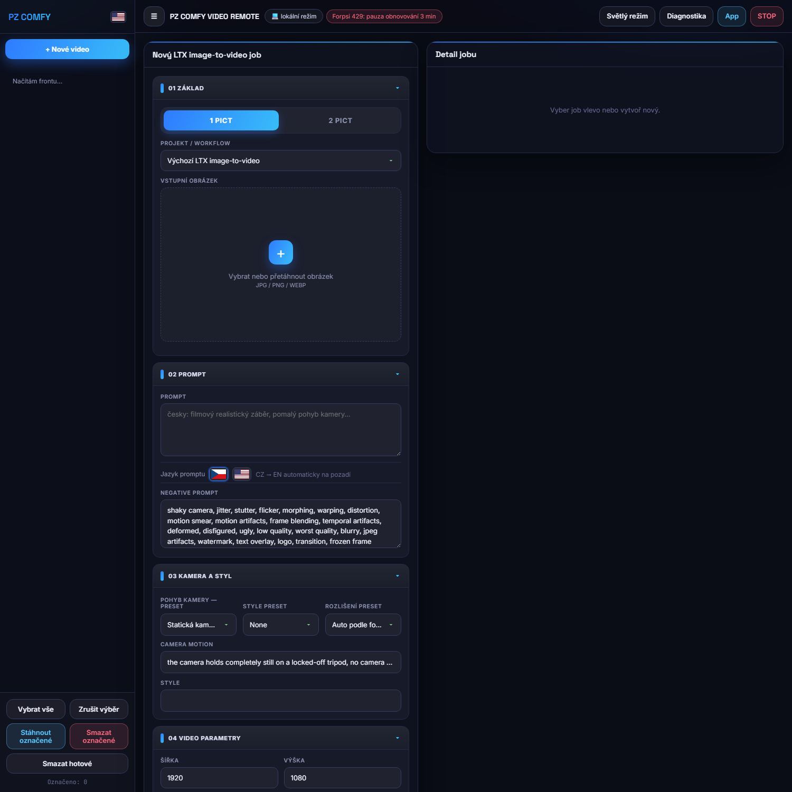

# PZ COMFYW LOCAL DIRECT — lokální verze na jedno PC



Lokální varianta [ComfyW](https://github.com/petroza/COMFY_PC_FTP_WORKER) bez FTP, bez workeru a bez přihlášení. Všechno běží na jednom počítači vedle ComfyUI: Python server drží frontu jobů, renderuje přes ComfyUI API (LTX 2.3 image-to-video) a výsledky ukládá lokálně do `data/outputs`.

```
┌──────────────────────────── jedno PC ───────────────────────────┐
│  prohlížeč ── http://127.0.0.1:8765 ── local_server.py          │
│                                            │ ComfyUI API :8000  │
│                                            ▼                    │
│                                     ComfyUI + LTX 2.3 (GPU)     │
└──────────────────────────────────────────────────────────────────┘
```

Webové rozhraní je 1:1 převzaté z FTP verze (stejný HTML/CSS/JS) — server má kompatibilní vrstvu `api.php`, takže vzhled i chování jsou identické s webovou aplikací.

## Spuštění

1. Rozbal/naklonuj kamkoliv na PC s ComfyUI a Pythonem 3.10+.
2. Spusť **`START_ALL.cmd`**:
   - když ComfyUI API už běží na portu 8000, nechá ho být (nezabije render),
   - když neběží, nastartuje ho přes `tools/START_COMFY_SAFE.ps1` a počká na náběh,
   - pak spustí lokální web a otevře http://127.0.0.1:8765.
3. Nahraj fotku, napiš prompt (česky — přeloží se automaticky), GENEROVAT VIDEO.

Alternativy: `START_LOCAL.cmd` (jen web, Comfy si spustíš sám), `START_COMFY.bat` (jen safe restart ComfyUI API), `START_LOCAL.sh` (Linux/Mac).

## Co umí

- 1 PICT (image-to-video) i 2 PICT (první + poslední frame / FLF2V)
- Fronta s živým stavem, editace pending jobů, rerun, zrušení, batch upload
- Překlad promptu CZ → EN na pozadí (Google GTX)
- Presety kamery/stylu/rozlišení, steps, CFG, motion strength, seed režimy, Prompt Enhance
- Chipy s reálným stavem GPU (využití, VRAM, teplota z nvidia-smi) a ComfyUI
- Diagnostika jedním tlačítkem

## Struktura

| Soubor / složka | K čemu je |
|---|---|
| `local_server.py` | Celý server — HTTP, fronta, ComfyUI klient, překlad, api.php kompatibilita |
| `web/index.html` | UI převzaté z FTP verze (BENTO GLASS skin) |
| `config.json` | Port, adresa ComfyUI, cesty workflow, sekce `comfy_start` pro safe start |
| `workflows/` | LTX 2.3 šablony (i2v + FLF2V, ComfyUI API formát) |
| `tools/START_COMFY_SAFE.ps1` | Bezpečný start ComfyUI backendu (ukončí držitele portu 8000) |
| `tools/STOP_LOCAL_SERVER.ps1` | Zastavení lokálního serveru |
| `data/` | Vstupy, výsledky, fronta (jobs.json), logy — **negituje se**, zůstává lokálně |

## Konfigurace

`config.json` — výchozí hodnoty fungují pro ComfyUI Desktop na portu 8000. Cesty v sekci `comfy_start` používají proměnné `%USERPROFILE%`/`%APPDATA%`, takže fungují na libovolném uživateli. Pokud máš ComfyUI jinde, uprav `comfy_start.main_py` a `python_exe`.

Žádné heslo, tokeny ani databáze — aplikace poslouchá jen na 127.0.0.1.

## Licence

MIT pro aplikační obal, pokud soubor neuvádí jinak. ComfyUI, LTX a modely třetích stran mají vlastní licence.
